<div align="center">

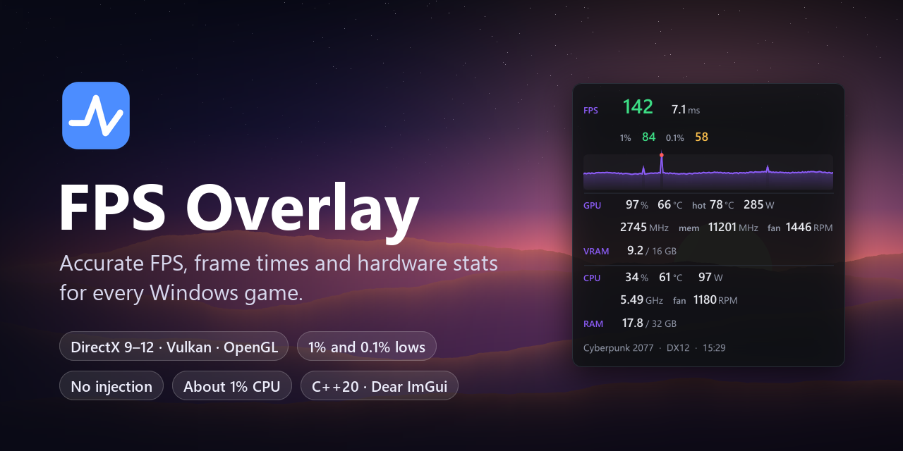

[](https://github.com/CodingIsCoolFr/FPSOverlay/releases/latest)
[](https://github.com/CodingIsCoolFr/FPSOverlay/releases)
[](https://github.com/CodingIsCoolFr/FPSOverlay/actions/workflows/build.yml)
[](LICENSE.txt)


**A fast, accurate frame rate and hardware overlay for Windows games.**<br>
Real frame timing straight from Windows. Nothing is injected into the game.

[**Download**](https://github.com/CodingIsCoolFr/FPSOverlay/releases/latest) &nbsp;·&nbsp;
[Features](#features) &nbsp;·&nbsp;
[Screenshots](#screenshots) &nbsp;·&nbsp;
[How it works](#how-it-works) &nbsp;·&nbsp;
[Build it](#building-from-source)

<br>

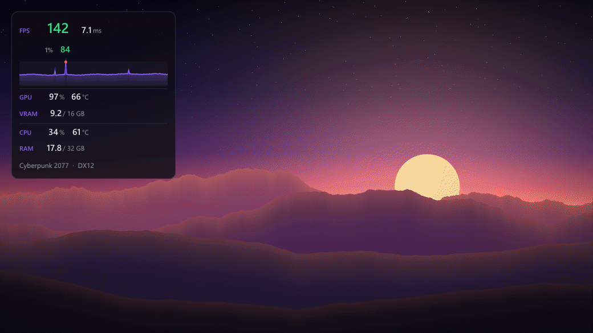

</div>

## Features

<table>
<tr>
<td width="50%" valign="top">

### 🎯 Real frame timing
Every frame the game shows is timed through Event Tracing for Windows, the same data
source as PresentMon. FPS, **1% low** and **0.1% low** come from real frame times, not a
once-per-second counter.

</td>
<td width="50%" valign="top">

### 🎮 Every graphics API
DirectX 9, 10, 11 and 12, Vulkan and OpenGL. Duplicate kernel events are filtered out,
so Vulkan and OpenGL games never show double their real frame rate.

</td>
</tr>
<tr>
<td valign="top">

### 📈 Stutter you can see
A live frame time graph with red markers on every stutter. A smooth average can hide
hitches; the graph and the lows cannot.

</td>
<td valign="top">

### 🌡️ Full hardware stats
GPU usage, temperatures, power, clocks, fan and video memory. CPU usage, temperature,
power, clock and fan. System memory, game name and a clock.

</td>
</tr>
<tr>
<td valign="top">

### 🪶 Light as a feather
Sensors are read on their own thread. NVIDIA cards are read through the driver's own NVML
library, which takes microseconds. Every sensor together costs under **2% of one CPU core**.

</td>
<td valign="top">

### 🛡️ Hands off the game
No DLL injection, no hooks, no game files touched. The overlay is its own small,
click-through window that stays on top of borderless games.

</td>
</tr>
<tr>
<td valign="top">

### 🎨 Yours to style
Three layouts, six positions, eight accent colors, any size from 50% to 250%, and
separate background and text opacity. Hold <kbd>Ctrl</kbd> to drag it anywhere; it snaps to the edges.

</td>
<td valign="top">

### ⚙️ Settings that stay out of the way
A dark settings window where every change applies at once. Then close it: the app lives in
the tray. Optional start with Windows, with no admin prompt at sign-in. New versions install
themselves while you are not playing.

</td>
</tr>
</table>

## Screenshots

### Three layouts

<p align="center">
  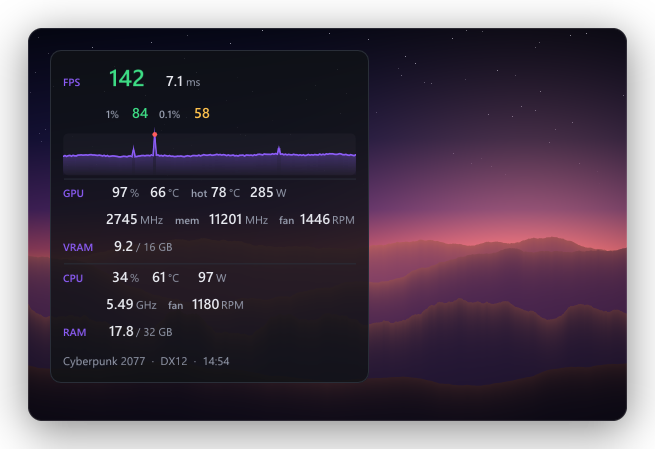
</p>

<p align="center">
  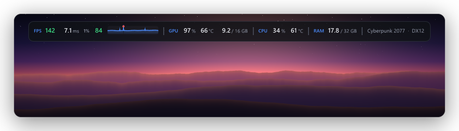
  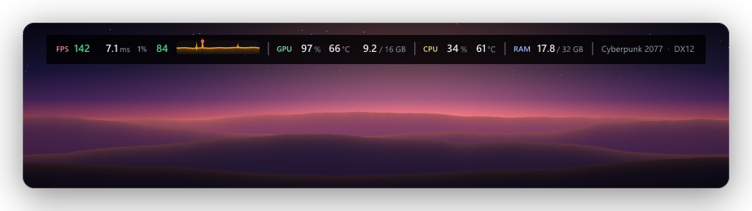
</p>

### The settings window

<p align="center">
  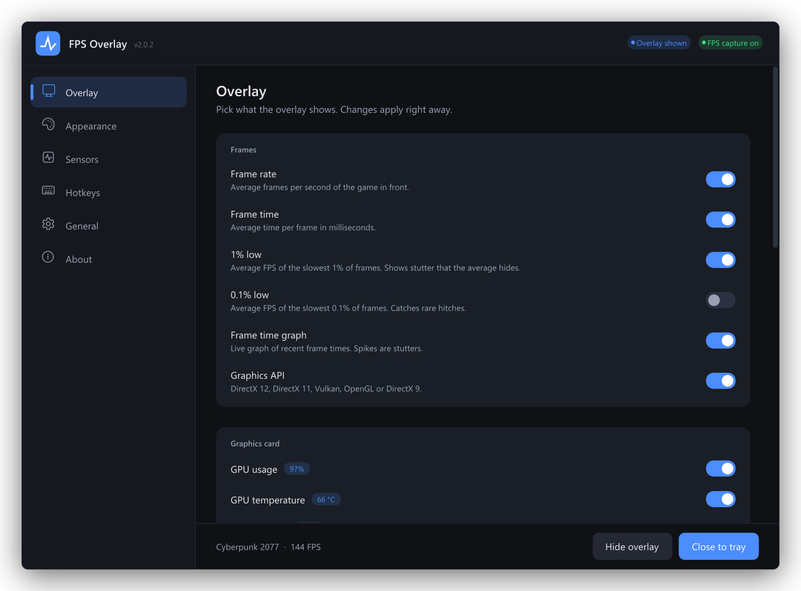
</p>

<table>
<tr>
<td width="33%">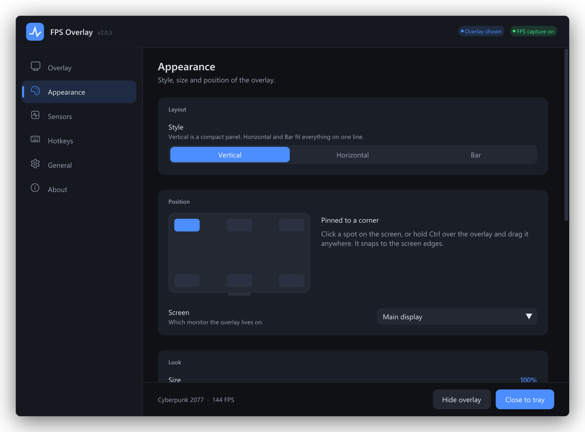<p align="center"><b>Appearance</b></p></td>
<td width="33%">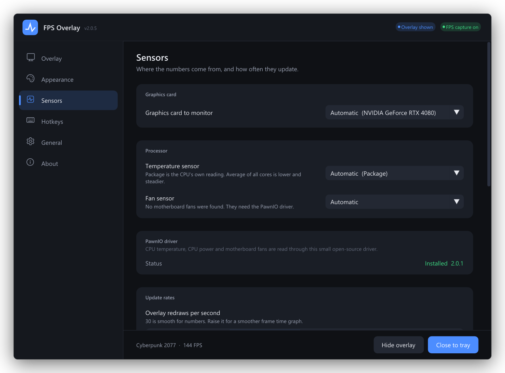<p align="center"><b>Sensors</b></p></td>
<td width="33%">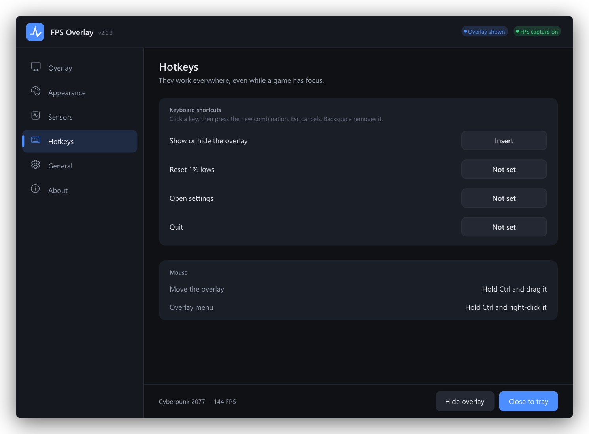<p align="center"><b>Hotkeys</b></p></td>
</tr>
<tr>
<td>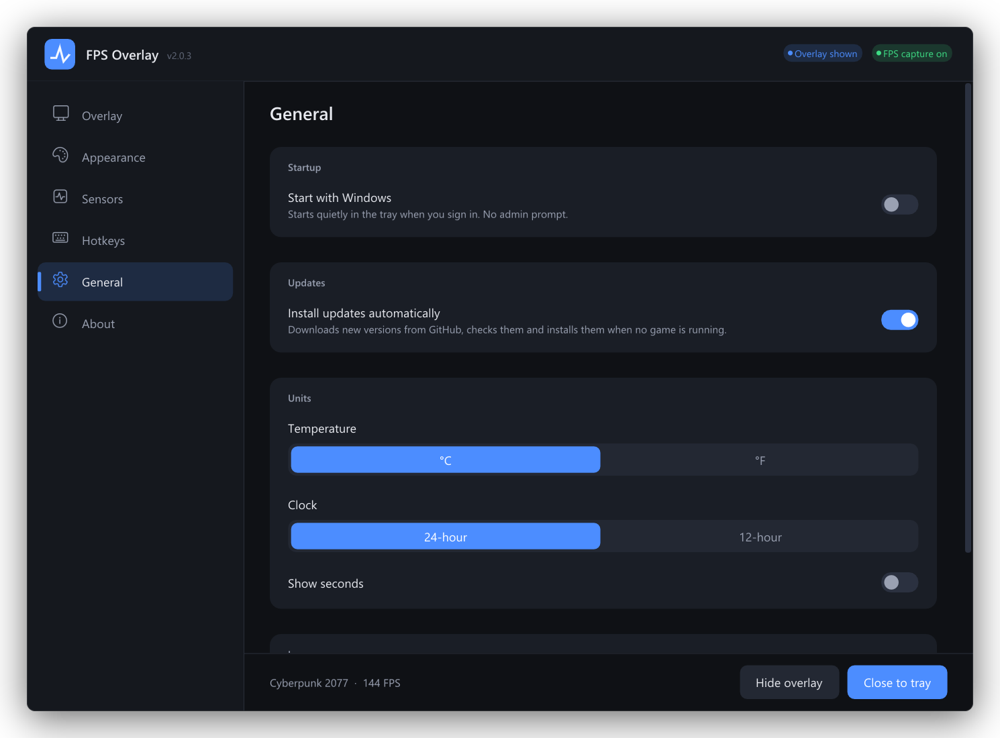<p align="center"><b>General</b></p></td>
<td>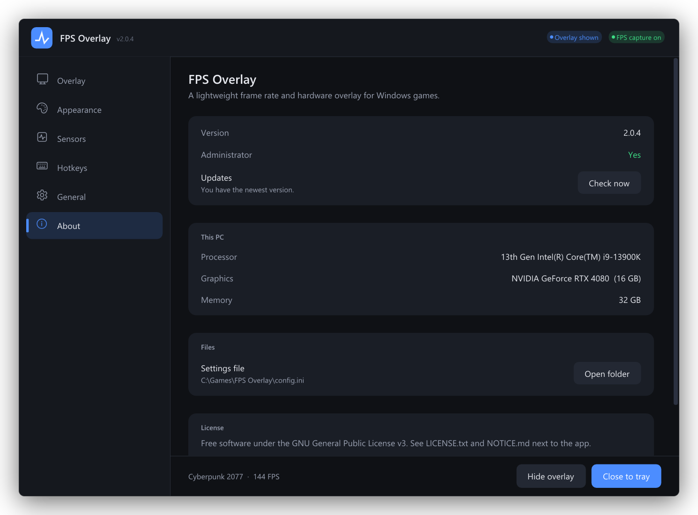<p align="center"><b>About</b></p></td>
<td>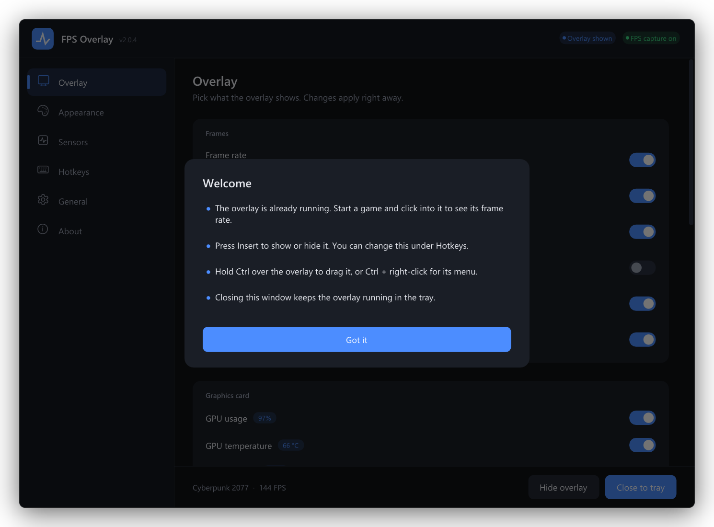<p align="center"><b>First run</b></p></td>
</tr>
</table>

<sub>Every picture here is drawn by the app's own renderer with sample data
(`python tools/docs/make_images.py`). The landscape behind the overlay is generated, not a game.</sub>

## Download and start

1. Download **`FPSOverlay.zip`** from the [latest release](https://github.com/CodingIsCoolFr/FPSOverlay/releases/latest).
2. Unzip it to any folder. Nothing is installed. From then on the app updates itself.
3. Run **`FPSOverlay.exe`** and click **Yes** on the admin prompt.
   Windows SmartScreen may warn about an unknown app: click **More info → Run anyway**.
4. Start a game in **borderless** or **windowed** mode and click into it. The overlay shows up.

> [!TIP]
> For CPU temperature, CPU power and motherboard fans, open *Settings → Sensors* and click
> **Install** next to **PawnIO**. It is a small, signed, open-source driver. A reboot is
> rarely needed.

**Requirements:** Windows 10 (1903 or newer) or Windows 11, 64-bit.

## Using it

| To do this | Do this |
|---|---|
| Show or hide the overlay | <kbd>Insert</kbd> (change it under *Hotkeys*) |
| Move the overlay | Hold <kbd>Ctrl</kbd> over it and drag. It snaps to the screen edges. |
| Open the overlay menu | Hold <kbd>Ctrl</kbd> over it and right-click |
| Open settings | Click the tray icon |
| Reset the 1% and 0.1% lows | Set a hotkey under *Hotkeys* |
| Start with Windows | *Settings → General*. It uses Task Scheduler, so there is no admin prompt at sign-in. |

Settings are saved in `config.ini` next to the exe, or in `%LOCALAPPDATA%\FPSOverlay` when that
folder is read-only. The log file, `FPSOverlay.log`, is in the same place.

### What it can show

| Group | Metrics |
|---|---|
| **Frames** | FPS · frame time · 1% low · 0.1% low · frame time graph with stutter markers · graphics API |
| **Graphics card** | Usage · temperature · hot spot · power · core clock · memory clock · fan · video memory |
| **Processor** | Usage · temperature · power · effective clock · fan |
| **Other** | System memory · game name · clock |

## How it works

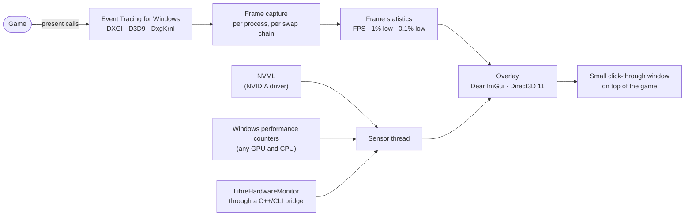

- **Frame capture.** The app listens to the same Windows events PresentMon uses. Each swap chain
  is tracked on its own, and the busiest one is the game. The events are filtered by ID in the
  kernel, so the app only receives about 1,500 events per second instead of 58,000.
- **Statistics.** FPS is the number of frames in the last second divided by the time they took.
  The lows are the mean of the slowest 1% and 0.1% of frames over the last 10 seconds (you can
  pick 5 to 60). These are the same definitions CapFrameX uses.
- **Sensors.** Each value comes from the fastest source that has it. LibreHardwareMonitor is only
  used for what nothing else gives (CPU temperature, CPU power, motherboard fans), and only the
  hardware on screen is updated.
- **CPU temperature.** The app reads the CPU's own package sensor straight through the PawnIO
  driver: one register (`IA32_PACKAGE_THERM_STATUS` on Intel, `THM_TCON_CUR_TMP` on Ryzen) on
  whatever core the sensor thread is on. Sensor libraries instead hop onto every core to read
  per-core registers, which wakes idle cores; one direct read takes under 0.1 ms instead of
  about 40 ms. Because a CPU's temperature jumps several degrees from one moment to the next,
  the app reads it 10 times a second and shows the mean, and the shown whole degree only
  changes once the reading has moved 0.75 °C, so the last digit does not flicker. The number
  turns red when the CPU reports that it is at its thermal limit. On Ryzen chips that add a
  fan-control offset (Tctl), the real die temperature (Tdie) is shown.
- **Overlay.** A per-pixel transparent window, exactly the size of its content. It ignores the
  mouse until you hold <kbd>Ctrl</kbd>, and can be hidden from screen recordings.

### Measured on a real PC

| Test | Result |
|---|---|
| FPS self-test: Direct3D 11 and OpenGL windows at 60, 100, 144 and 237 FPS | Within **0.01 FPS** of the target |
| One CPU temperature reading | **under 0.1 ms** direct, against about 40 ms through LibreHardwareMonitor |
| Sensor thread CPU use for CPU temperature and power | **0.0–0.1% of one core**, against 0.9% before |
| CPU temperature over 15 s at the same load | **65–70 °C** averaged, against 63–76 °C from single readings |
| Readings against `nvidia-smi`, Windows counters and WMI | GPU temperature within 0.1 °C, GPU power within 0.1 W, VRAM within 2 MB, RAM exact |
| Unit tests | **87 checks**, all pass |

## Building from source

You need **Visual Studio 2022 or newer** with *Desktop development with C++* and
*C++/CLI support*. No .NET developer pack is needed.

```bat
build.bat
```

This builds everything, runs the unit tests and puts a portable copy in `dist\FPSOverlay\`
(and `dist\FPSOverlay.zip`). For UI work, `msbuild FPSOverlay.vcxproj /p:FpsoAsInvoker=true`
builds a copy that does not ask for admin rights.

```
src/
  app/        main loop, config, log, update check, developer tools
  capture/    ETW frame capture, frame statistics, target selection
  sensors/    sensor thread, NVML, performance counters, LibreHardwareMonitor client, PawnIO
  render/     Direct3D 11 device and swap chains
  ui/         theme, widgets, overlay, settings window
  platform/   Win32 helpers, shell, Task Scheduler
  locale/     translations and right-to-left text shaping
bridge/       FPSOverlay.Sensors.dll: C++/CLI bridge to LibreHardwareMonitor
tests/        unit tests
locales/      translation files
tools/        translation and documentation image scripts
```

<details>
<summary><b>Command-line options</b></summary>

| Option | What it does |
|---|---|
| `--tray` | Start without opening the settings window |
| `--selftest` | Measure test windows with known frame rates and report the accuracy |
| `--probe [seconds]` | Print live sensor readings, their CPU cost and every temperature sensor |
| `--update-check` | Check, download, verify and unpack the latest release next to the exe, without installing it |
| `--temps [seconds]` | Log every CPU temperature reading once a second with the time, to compare with another tool |
| `--shots <folder> [--lang <code>] [--scale <factor>]` | Render every settings page and overlay layout to PNG |
| `--demo-frames <folder> [--count <n>] [--layout vertical\|horizontal\|bar]` | Render an animated overlay sequence to transparent PNGs |
| `--make-icon <file.ico>` | Regenerate the app icon |

</details>

## Languages

English, العربية, Deutsch, Español, فارسی, Français, Italiano, 日本語, 한국어, Nederlands, Polski,
Português (Brasil), Português (Portugal), Русский, Türkçe and 简体中文. Arabic and Persian are
drawn right to left.

The translations live in `locales/`. Corrections are welcome: open an issue or a pull request.

## FAQ

<details>
<summary><b>Will it get me banned?</b></summary>

It never changes the game: no injection, no hooks, nothing written to the game's process or
files. Frame data comes from Windows itself. No tool can promise how every anti-cheat behaves,
but this one only uses standard Windows interfaces.
</details>

<details>
<summary><b>Why does it need admin rights?</b></summary>

The Windows frame events and the CPU sensors are only open to administrators (or members of
the *Performance Log Users* group).
</details>

<details>
<summary><b>The overlay does not show in my game.</b></summary>

Switch the game to **borderless** or **windowed** mode. Exclusive fullscreen draws over every
other window, this overlay included.
</details>

<details>
<summary><b>Why does another app show a different CPU temperature?</b></summary>

Apps can show two different CPU readings. FPS Overlay shows **Package** (on Ryzen,
**Tctl/Tdie**): the temperature the CPU itself reports and throttles on. HWiNFO recommends it,
Corsair iCUE uses it, and NZXT CAM shows it by default. NZXT CAM also has an *Average* setting
(Settings → General → CPU Temperature Display), which averages all cores and reads 10–15 °C
lower on a busy hybrid Intel CPU. To match that, pick *Average of all cores* under
*Settings → Sensors → Temperature sensor*, or set CAM back to *Package*.
</details>

<details>
<summary><b>CPU temperature is missing.</b></summary>

Install PawnIO from *Settings → Sensors*. Modern CPUs only expose their temperature through a driver.
</details>

## Privacy

No telemetry, no accounts. The only network traffic is the update check: at start and every
6 hours the app asks GitHub for the latest release of this repository. When a newer one exists
and automatic updates are on (the default), it downloads the release zip, checks its SHA-256
fingerprint against the one GitHub publishes, and installs it when no game is running. Turn this
off under *Settings → General*; the *About* page then only tells you that an update exists.

## Third-party components

| Component | License |
|---|---|
| [Dear ImGui](https://github.com/ocornut/imgui) | MIT |
| [LibreHardwareMonitor](https://github.com/LibreHardwareMonitor/LibreHardwareMonitor) 0.9.6, bundled in `lhwm-wrapper.dll` | MPL 2.0 |
| [RTLScript](https://github.com/oscar7070/RTLScript), a fork of FarsiType | MIT |
| [PawnIO](https://pawnio.eu/) driver installer | see its project page |
| [PawnIO.Modules](https://github.com/namazso/PawnIO.Modules/releases/tag/0.1.6) 0.1.6 (`IntelMSR.bin`, `AMDFamily17.bin`, embedded in the exe) | LGPL 2.1 or later |

Segoe UI and Segoe Fluent Icons are loaded from Windows at run time and are not redistributed.

## License

GNU General Public License v3. See [LICENSE.txt](LICENSE.txt) and [NOTICE.md](NOTICE.md).
